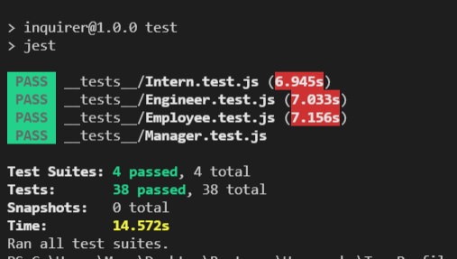
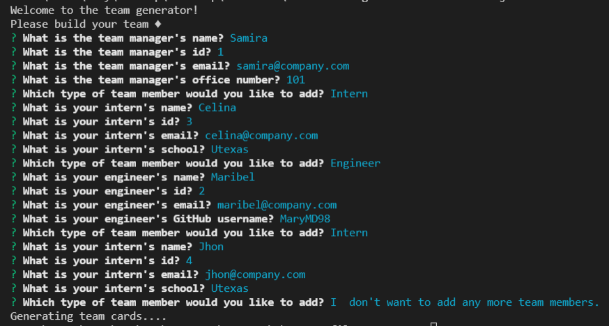
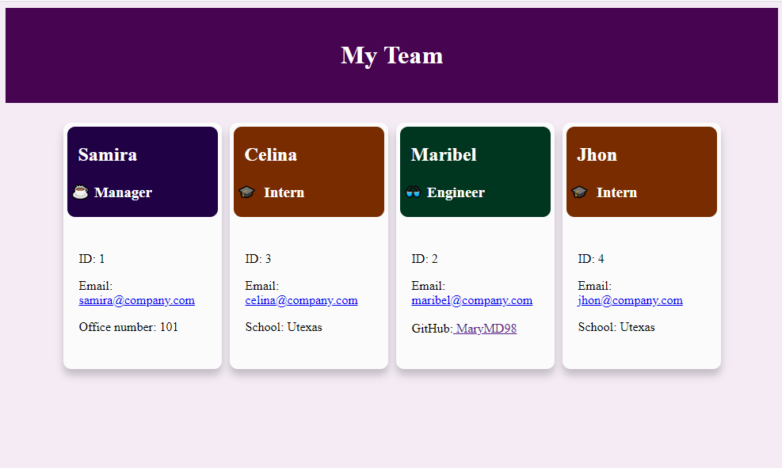

# Unit 10 Homework: Team Profile Generator

## [Description](#description)

In this homework I use Node.js command-line application that takes in information about employees on a software engineering team. After answering all the questions, the application generates an HTML webpage that dsplays summaries for each person. 

When the application starts, the user is prompt to enter the manager information, such as name, ID, email and office number. Then the user is presented with a menu with options to add an engineer or an intern or to finish building the team. When selecting the engineer option, the user is prompt to submit the engineer's name, Id, emil and GitHub username. When selecting the intern option, the user is prompt to submit the intern's name, id, email and school. After filling the information the user is taken back to the menu to select an otpion. When the user choses to finish building team, the aplication generates an html with the answers provided by the user. 

The HTML contains cards of each team member, each card contains the information gather in the command prompt. When the github username is clicked, then the github profile opens in a new tab. when the email address is clicked, then the default email program opens and populates the To field with the email address.

Here is a screencapture video demostrating the functinality of the [application](https://watch.screencastify.com/v/gWULa8QVKPIP0794AgvH).

## Table of Content

* [Description](#description)
* [Installation](#installation)
* [Test](#test)
* [Usage](#usage)
* [License](#license)
* [Contributing](#contributing)
* [Questions](#questions)

## [Installation](#installation)
To initialie, run the following command.

    node index.js

## [Test](#test)
To run tests, run the following command

    npm test

## [Usage](#usage)

This application generates and HTML that displays team member profile information.

This application contains tests for every class to ensure each section works accordingly.

## Screenshot of Team Profile generator:

## [License](#license)

[MIT](https://opensource.org/licenses/MIT) License.

## [Contributing](#contributing)

none

## [Questions](#questions)

If you have any questions about the repo, or would like to contact me directly, 
here is my email: maribel.montes4@gmail.com. You can find more of my work at [Maribel Montes](https://github.com/MaryMD98).

